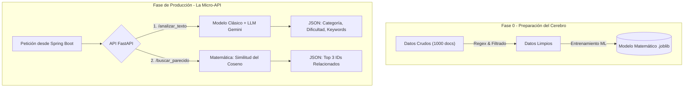

# 🗺️ TechMind: Área de Datos (Documentación Final)

Bienvenidos al repositorio central del equipo de Data. Este documento sirve como documentación final para entender cómo transformamos texto crudo en un "Cerebro" de Inteligencia Artificial que alimentará a toda la aplicación.

---

## 👥 Roles del Equipo (Célula de Datos)

Para trabajar de forma ágil y profesional, dividimos la responsabilidad de la ciencia de datos en áreas especializadas:

- **Ingeniería de Datos:** Especialistas en Data Wrangling y Limpieza de Datos. Encargados de sanitizar el texto y dejar los datos legibles para la IA.
- **Machine Learning:** Especialistas en modelos predictivos y matemáticas. Encargados de entrenar los modelos TF-IDF, algoritmos de clasificación y motores de Similitud del Coseno.
- **Arquitectura e Integración:** Especialistas en Arquitectura de Datos e Integración de IA. Encargados de la recolección inicial, conexión con LLMs (Prompt Engineering) y despliegue de la API final.

---

## 📊 Diagrama General del Flujo de Trabajo

Este diagrama explica de forma sencilla cómo viajan los datos desde la recolección hasta llegar al servidor de Backend, para que cualquier miembro del proyecto lo pueda entender.

## 🚀 Fases del Proyecto (Completadas)

### Fase 1: Ingesta de Datos

- **Objetivo:** Evitar el "arranque en frío" del proyecto recolectando 1000 documentos técnicos (GitHub, arXiv, etc.).
- **Resultado:** Archivo `dataset_techmind_raw.csv`.

### Fase 2: Limpieza de Datos / Data Wrangling

- **Objetivo:** Transformar el texto ruidoso limpiando etiquetas HTML, URLs y unificando formatos para que la máquina no se confunda.
- **Resultado:** Archivo de datos limpios listo para vectorizar.

### Fase 3 y 4: Enfoque Híbrido (Machine Learning + LLM)

- **Decisión de Arquitectura:** En lugar de entrenar una Regresión Logística supervisada que requiere de miles de etiquetas manuales, optamos por un modelo **Híbrido**.
- **Clasificación (LLM):** Integramos la API de Gemini para analizar semánticamente el texto y extraer **Categoría, Dificultad y Palabras Clave (Tags)** de manera automática, sin "arranque en frío".
- **Búsqueda Semántica / Recomendación (ML Clásico):** Tomamos los datos limpios de la Fase 2, los pasamos por un pipeline de `TfidfVectorizer` y calculamos la **Similitud del Coseno** de forma 100% local, devolviendo los documentos más parecidos al instante y sin incurrir en costos de API.

### Fase 5: API Final Modular

- **Objetivo:** Encapsular los modelos matemáticos y Gemini dentro de una API web rápida (FastAPI).
- **Decisión de Arquitectura (Importante):** No exponer nuestra API a internet público. Será una "Micro-API" de uso interno. El Backend será el único autorizado a consumir esta API internamente para obtener los cálculos.
- **Estado Actual:** Estructura construida y endpoints conectados a los modelos reales. 
  1. `/analizar_texto`: Conectado a Gemini.
  2. `/buscar_parecido`: Conectado al motor local TF-IDF.
