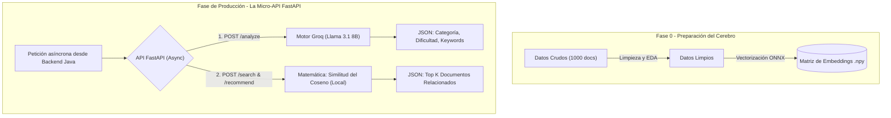

# 🗺️ TechMind: Área de Datos (Documentación Final)

Bienvenidos al repositorio central del equipo de Data. Este documento sirve como documentación final para entender cómo transformamos texto crudo en un "Cerebro" de Inteligencia Artificial de alto rendimiento que alimenta a toda la aplicación.

---

## 👥 Roles del Equipo (Célula de Datos)

Para trabajar de forma ágil y profesional, dividimos la responsabilidad de la ciencia de datos en áreas especializadas:

- **Ingeniería de Datos:** Especialistas en Data Wrangling y Limpieza de Datos. Encargados de sanitizar el texto y dejar los datos legibles para la IA.
- **Machine Learning:** Especialistas en modelos matemáticos y NLP. Encargados de la vectorización de texto utilizando modelos ONNX locales cuantizados y motores de Similitud del Coseno.
- **Arquitectura e Integración:** Especialistas en Arquitectura de Datos e Integración de IA. Encargados de la recolección inicial, conexión con LLMs (Groq - Llama 3.1) vía *Prompt Engineering*, y diseño de la API asíncrona final.

---

## 📊 Diagrama General del Flujo de Trabajo

Este diagrama explica de forma sencilla cómo viajan los datos desde la recolección hasta llegar al servidor de Backend.


```mermaid
graph TD
    subgraph Fase0 [Fase 0 - Preparación del Cerebro]
        A["Datos Crudos (1000 docs)"] -->|"Limpieza y EDA"| B["Datos Limpios"]
        B -->|"Vectorización ONNX"| C[("Matriz de Embeddings .npy")]
    end

    subgraph Produccion [Fase de Producción - La Micro-API FastAPI]
        D["Petición asíncrona desde Backend Java"] --> E{"API FastAPI (Async)"}
        
        E -->|"1. POST /analyze"| F["Motor Groq (Llama 3.1 8B)"]
        F --> G["JSON: Categoría, Dificultad, Keywords"]
        
        E -->|"2. POST /search & /recommend"| H["Matemática: Similitud del Coseno (Local)"]
        H --> I["JSON: Top K Documentos Relacionados"]
    end
```

## 🚀 Fases del Proyecto (Completadas)

### Fase 1: Ingesta de Datos

- **Objetivo:** Evitar el "arranque en frío" del proyecto recolectando 1000 documentos técnicos.
- **Resultado:** Archivo `dataset_techmind_raw.csv`.

### Fase 2: Limpieza de Datos / Data Wrangling

- **Objetivo:** Preparar un dataset de alta calidad mediante auditoría, limpieza, normalización y enriquecimiento del contenido. Eliminación de ruido (HTML, URLs, duplicados) y generación de identificadores únicos (doc_id).
- **Resultado:** Dataset limpio, validado y enriquecido (`dataset_techmind_ready.csv`), sirviendo como base de conocimiento matemática.

### Fase 3 y 4: Enfoque Híbrido Avanzado (ONNX + Groq LLM)

- **Decisión de Arquitectura:** En lugar de depender de regresiones logísticas rígidas, optamos por un **Modelo Híbrido de Alto Rendimiento**.
- **Clasificación (LLM ultrarrápido):** Reemplazamos Gemini por la API de **Groq** usando **Llama 3.1 8B**. Esto redujo los tiempos de inferencia de 4.27s a **0.79s**, permitiendo extraer Categoría, Dificultad y Palabras Clave en tiempo real.
- **Búsqueda Semántica (ML Local):** Implementamos un motor de vectorización multilingüe local usando **ONNX Runtime Quantizado**. Calculamos la Similitud del Coseno matemáticamente mediante matrices NumPy ultra rápidas, devolviendo documentos relacionados sin depender de internet ni de costes de API.

### Fase 5: API Final Modular y Asíncrona (Producción)

- **Objetivo:** Encapsular los modelos matemáticos y la conexión a Groq dentro de una API web concurrente usando FastAPI.
- **Seguridad y Diseño:** La API no se expone a internet público (se despliega en una subred privada de Oracle Cloud). El Backend (Spring Boot) es el único consumidor autorizado.
- **Resiliencia (Fast-Fail):** La API cuenta con mecanismos de validación `Pydantic` estrictos, políticas de reintentos (`Tenacity`) y un sistema *Fast-Fail* que aborta el arranque de los contenedores Docker si detecta anomalías en el sistema de archivos (ej. modelos faltantes).
- **Estado Actual:** 100% Finalizado. Todo el sistema está programado con `async/await` para no bloquear el *Event Loop* bajo carga máxima.
  1. `/api/v1/analyze`: Clasificación con Groq.
  2. `/api/v1/search`: Búsqueda por texto natural (ONNX).
  3. `/api/v1/recommend`: Recomendación cruzada de documentos (NumPy).

---

## 🛠️ Instrucciones para Desarrolladores (Setup Local)

Debido a los límites de tamaño de GitHub y a las mejores prácticas de Git, los modelos matemáticos finales (`.onnx` y `.npy`) están ignorados en el `.gitignore`. Si clonaste este repositorio y deseas correr la API localmente, tienes dos opciones:

### Opción A: Modo MOCK (Prueba de Integración Rápida)
Ideal para los desarrolladores de Frontend y Backend que solo quieren validar la comunicación y recibir los JSON correctos sin ejecutar los pesados modelos de Inteligencia Artificial.
1. Ve a la carpeta `Data/5.API_Final`.
2. Renombra `.env.example` a `.env` (o crea uno nuevo).
3. Agrega la línea: `USE_MOCK=True`
4. Al correr FastAPI, el sistema de protección *Fast-Fail* se desactivará y la API arrancará al instante simulando las respuestas.

### Opción B: Generación Local de la Inteligencia Artificial
Ideal si deseas probar el motor de IA real en tu computadora. Necesitarás generar los archivos binarios pesados localmente.
1. Ve a la carpeta `Data/5.API_Final`.
2. Activa tu entorno virtual e instala los requerimientos (`pip install -r requirements.txt`).
3. Ejecuta el script de cuantización (descarga el modelo base y lo optimiza a ONNX):
   ```bash
   python scripts/quantize_model.py
   ```
4. Ejecuta el script de *embeddings* (lee el dataset de la Fase 2 y calcula las posiciones vectoriales matemáticas de todos los documentos, puede tardar unos minutos):
   ```bash
   python scripts/generate_embeddings.py
   ```
5. Asegúrate de tener tu `.env` con tu `GROQ_API_KEY` y con `USE_MOCK=False`.
6. ¡Listo! Ya puedes iniciar la API real con `uvicorn main:app`.
