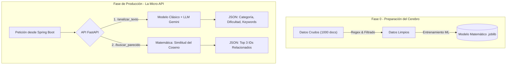

# 🗺️ TechMind: Área de Datos (README + Roadmap)

Bienvenidos al repositorio central del equipo de Data. Este documento sirve como guía, documentación y hoja de ruta para entender cómo transformamos texto crudo en un "Cerebro" de Inteligencia Artificial que alimentará a toda la aplicación.

---

## 👥 Roles del Equipo (Célula de Datos)

Para trabajar de forma ágil y profesional, dividimos la responsabilidad de la ciencia de datos en áreas especializadas:

- **Ingeniería de Datos:** Especialistas en Data Wrangling y Limpieza de Datos. Encargados de sanitizar el texto y dejar los datos legibles para la IA.
- **Machine Learning:** Especialistas en modelos predictivos y matemáticas. Encargados de entrenar los modelos TF-IDF, algoritmos de clasificación y motores de Similitud del Coseno.
- **Arquitectura e Integración:** Especialistas en Arquitectura de Datos e Integración de IA. Encargados de la recolección inicial, conexión con LLMs (Prompt Engineering) y despliegue de la API final.

---

## 📊 Diagrama General del Flujo de Trabajo

Este diagrama explica de forma sencilla cómo viajan los datos desde la recolección hasta llegar al servidor de Backend, para que cualquier miembro del proyecto lo pueda entender.

---

## 🚀 Fases del Proyecto y Estado Actual

### Fase 1: Ingesta de Datos (✅ Completada)

- **Objetivo:** Evitar el "arranque en frío" del proyecto recolectando 1000 documentos técnicos (GitHub, arXiv, etc.).
- **Resultado:** Archivo `dataset_techmind_raw.csv`.

### Fase 2: Limpieza de Datos / Data Wrangling (✅ Completada)

- **Objetivo:** Transformar el texto ruidoso limpiando etiquetas HTML, URLs y unificando formatos para que la máquina no se confunda.
- **Resultado:** Archivo de datos limpios listo para vectorizar.

### Fase 3: Clasificación e Integración del LLM (⏳ En Progreso)

- **Objetivo (ML):** Entrenar un modelo de Machine Learning clásico (ej. TF-IDF + Regresión) con los datos limpios para predecir la **Categoría** del texto entrante.
- **Objetivo (LLM):** Integrar la API de Gemini para leer el texto y extraer el nivel de **Dificultad** y **Palabras Clave (Tags)**.

### Fase 4: Búsqueda Semántica / Recomendación (⏳ En Progreso)

- **Objetivo:** Vectorizar los textos y usar *Similitud del Coseno*. Cuando entre un texto nuevo, la matemática comparará ese vector contra nuestra "Fase 0" y encontrará los 3 documentos que apuntan en la misma dirección semántica.

### Fase 5: API Final Modular (⏳ En Progreso)

- **Objetivo:** Encapsular los modelos matemáticos y Gemini dentro de una API web rápida (FastAPI).
- **Decisión de Arquitectura (Importante):** No exponer nuestra API a internet público. Será una "Micro-API" de uso interno. El Backend será el único autorizado a consumir esta API internamente para obtener los cálculos.
- **Estado Actual:** Estructura de código modular ya construida (`routers`, `services`). Actualmente configurada para devolver *Mock Data* (datos estáticos de prueba) con el fin de desbloquear inmediatamente a los equipos de Backend y Frontend mientras se entrenan los modelos finales.
