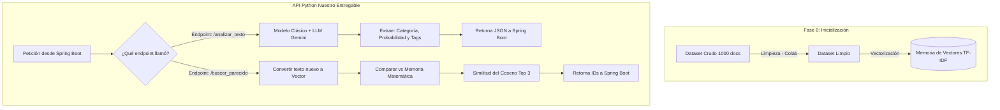

# 🗺️ Roadmap: Equipo de Datos (TechMind)

Este documento define la ruta de trabajo exclusiva para nuestro equipo de Data. Aquí detallamos nuestro objetivo, el flujo de trabajo visual, qué pasos seguiremos para lograrlo y **qué le vamos a entregar al equipo de Desarrollo (Backend)**.

---

## 📊 Diagrama General del Flujo de Datos
Este es el esquema interno de nuestra API de Python y cómo se conectará con el resto del proyecto.

---

## 🎯 Nuestro Producto Final (El Entregable)
Nosotros construimos el "Cerebro". El objetivo final es entregarle al Backend una **API en Python (FastAPI/Flask)** con dos funciones claras para que ellos consuman:

1. **`/analizar_texto`:** El Backend nos manda un texto nuevo, y nosotros le devolvemos un JSON con la clasificación y palabras clave para que él lo guarde en su base de datos MySQL.
2. **`/buscar_parecido`:** El Backend nos manda un texto, y nosotros usando cálculos matemáticos le devolvemos los IDs de los 3 documentos pre-cargados más relacionados semánticamente.

---

## 🚀 Fases del Proyecto y Objetivos

### Fase 1: Ingesta de Datos (Completada ✅)
- **Responsable:** Maxi
- **¿Qué buscamos?** Evitar el "Problema del Arranque en Frío". Recolectamos datos heterogéneos (GitHub, arXiv, tutoriales, ruido web) para que, el día de la presentación, nuestra base de datos arranque con 1000 documentos pre-cargados listos para ser recomendados.
- **Salida:** `dataset_techmind_raw.csv`.

### Fase 2: Limpieza de Datos (Data Wrangling)
- **Responsables:** Nairobi / Rodrigo
- **¿Qué buscamos?** Trabajar en Google Colab para escribir algoritmos (Pandas, Regex) que transformen el CSV ruidoso en texto puro. Necesitamos limpiar HTML roto, enmascarar código fuente y unificar formatos para no confundir a los modelos.
- **Salida:** `dataset_techmind_clean.csv`.

### Fase 3: Clasificación e Integración del LLM
- **¿Qué buscamos?** Entender de qué trata el texto entrante. 
  - Usaremos un modelo de Machine Learning clásico y veloz (ej. Random Forest o Naive Bayes) para la clasificación de categoría.
  - Nos conectaremos a una API de LLM gratuita (ej. Gemini) usando *Prompt Engineering* exclusivo para extraer "palabras clave", en lugar de intentar entrenar un LLM nosotros mismos.

### Fase 4: Búsqueda Semántica (Sistema de Recomendación)
- **¿Qué buscamos?** Cumplir con el requisito del Hackathon de "Encontrar contenidos relacionados".
- **¿Cómo?** Vectorizaremos los textos y aplicaremos Similitud del Coseno. Cuando entre un texto nuevo, nuestra matemática comparará ese vector contra nuestra "Fase 0" y encontrará los documentos que apuntan en la misma dirección semántica (incluso si no usan las mismas palabras exactas).

### Fase 5: Empaquetado (El "Hand-off" al Backend)
- **¿Qué buscamos?** Encapsular todo el código de las fases anteriores en una API de Python estructurada.
- **Éxito:** El equipo de Backend puede llamar a nuestras dos URLs desde Java sin tener que entender de algoritmos o matemáticas, y el Frontend tiene datos confiables para graficar.
