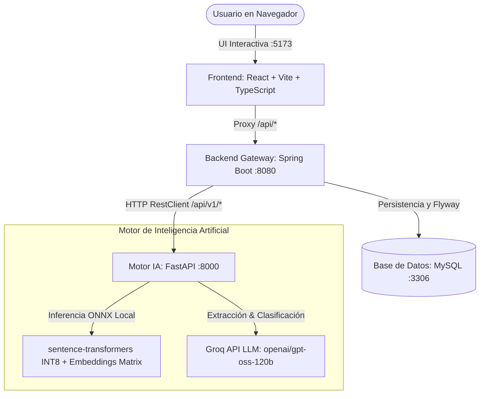

# 🧠 TechMind — Organización Inteligente de Conocimiento

> **Hackathon ONE G9 LATAM — Team 10**

<div align="center">
  
  
  
  
  
  <br/>
  
  
  
  
  
</div>

<br/>

**TechMind** es una plataforma integral de organización y estructuración de contenido técnico mediante Inteligencia Artificial, Machine Learning y Procesamiento de Lenguaje Natural (NLP). El sistema recibe artículos, tutoriales o documentación técnica en bruto, clasifica automáticamente el contenido en su área correspondiente (Backend, DevOps, Data Science, IA, etc.), extrae palabras clave semánticas relevantes, deduce el nivel de dificultad técnica (Principiante, Intermedio, Avanzado) y permite realizar recomendaciones y búsquedas semánticas vectoriales a partir de una base de conocimiento curada.

---

## 👥 Equipo

| Nombre | Rol |
|---|---|
| **Rodrigo Munoz** | Data Scientist |
| **Juan Manuel Rios** | Backend Developer |
| **Maximiliano Rodriguez** | Data Scientist |
| **Alexis Hinojosa Lopez** | Frontend Developer |
| **Nairobi Betancourt** | Data Analyst |
| **Valentina Parra** | Software Engineer |

---

## 🏗️ Arquitectura del Sistema

El ecosistema está construido bajo una arquitectura de microservicios desacoplada y orientada a rendimiento:



* **Frontend (`/front-end`):** SPA construida con React 19, TypeScript, Vite y TailwindCSS. Maneja el estado, renderizado reactivo de videos temáticos (Dark/Light mode), gráficos de métricas y formularios de ingestión. Corre en `http://localhost:5173`.
* **Backend (`/back-end`):** API REST empresarial construida con Java 17 y Spring Boot. Orquesta la persistencia relacional de documentos y keywords mediante Spring Data JPA y migraciones automáticas con Flyway. Corre en `http://localhost:8080`.
* **Motor de IA (`/Data/5.API_Final`):** Microservicio en Python con FastAPI. Aloja un pipeline híbrido: inferencia semántica local cuantizada en formato ONNX (búsqueda vectorial y recomendaciones) y LLM ultrarrápido vía Groq para extracción y clasificación. Corre en `http://localhost:8000`.

---

## 📦 Preparación de Modelos de Inteligencia Artificial (ONNX & Embeddings)

> [!IMPORTANT]
> Los modelos binarios de Machine Learning (`*.onnx`, `*.npy`, `*.joblib`) superan los 150 MB y **están ignorados por `.gitignore`** para evitar saturar el repositorio de Git. 

Para que el microservicio de IA arranque en local, asegúrate de que existan los archivos en la carpeta `Data/5.API_Final/models/`:

### Estructura requerida en `Data/5.API_Final/models/`:
```
Data/5.API_Final/models/
├── dataset_reference.joblib              # 1008 documentos técnicos de referencia
├── corpus_embeddings.npy                 # Matriz de embeddings precalculados
└── onnx_model_quantized/
    ├── config.json                       # Configuración del modelo
    ├── corpus_embeddings.npy             # Matriz normalizada para similitud de coseno
    ├── model_quantized.onnx              # Modelo sentence-transformers cuantizado a INT8
    ├── ort_config.json                   # Configuración ONNX Runtime
    ├── special_tokens_map.json           # Mapeo de tokens
    ├── tokenizer.json                    # Tokenizador multilingüe rápido
    └── tokenizer_config.json
```

### ¿Cómo regenerar los modelos si no los tienes?
Si clonaste el repositorio desde cero y no cuentas con la carpeta `models`, puedes generarla automáticamente con los scripts incluidos:

```bash
cd Data/5.API_Final
python -m venv .venv
# Activar entorno virtual:
# Windows: .\.venv\Scripts\activate
# Linux/Mac: source .venv/bin/activate
pip install -r requirements.txt

# 1. Descarga el modelo base y lo exporta a ONNX cuantizado INT8
python scripts/quantize_model.py

# 2. Genera los embeddings vectoriales sobre el dataset de referencia
python scripts/generate_embeddings.py
```

---

## ⚙️ Configuración de Variables de Entorno (.env)

El proyecto incluye archivos `.env.example` listos para ser copiados a `.env` en cada uno de los microservicios:

### 1. Backend (`back-end/.env`)
Configura la conexión a tu base de datos MySQL local:
```properties
DB_URL=jdbc:mysql://localhost:3306/techmind
DB_USER=root
DB_PASSWORD=
```

### 2. Frontend (`front-end/.env`)
Configura la ruta del proxy de desarrollo de Vite (debe ser `/api` relativa para evitar bloqueos CORS):
```properties
VITE_API_URL=/api
```

### 3. Motor de IA (`Data/5.API_Final/.env`)
Configura tu clave de Groq y el modelo LLM a utilizar:
```properties
GROQ_API_KEY=tu_api_key_de_groq_aqui
GROQ_MODEL=openai/gpt-oss-120b
USE_MOCK=False
```
*(Si no tienes API Key de Groq, puedes establecer `USE_MOCK=True` para desarrollo sin consumo de API).*

---

## 🚀 Guía de Instalación y Ejecución Local (Paso a Paso)

### Requisitos Previos
1. **XAMPP / MySQL:** Con el servicio MySQL activo en el puerto `3306`.
2. **Python 3.10+**: Con `pip` y `venv`.
3. **Java 17+ y Maven** (o usando el wrapper `./mvnw` incluido).
4. **Node.js 18+ y npm/pnpm**.

### Paso 1: Inicializar la Base de Datos
1. Inicia **XAMPP** y arranca el módulo **MySQL**.
2. Abre phpMyAdmin (`http://localhost/phpmyadmin`) o tu cliente MySQL favorito.
3. Crea una base de datos vacía llamada **`techmind`** con cotejamiento `utf8mb4_unicode_ci`.
   *(Spring Boot y Flyway se encargarán de crear y poblar automáticamente las tablas `documents`, `keywords` y `document_keywords`).*

---

### Paso 2: Ejecutar los Servicios (3 Terminales)

Abre **3 terminales separadas** en la raíz del proyecto `RLocal`:

#### 🟢 Terminal 1: Motor de Inteligencia Artificial (FastAPI)
```bash
cd Data/5.API_Final
python -m venv .venv
.\.venv\Scripts\activate      # En Linux/Mac: source .venv/bin/activate
pip install -r requirements.txt
python -m uvicorn main:app --reload --port 8000
```
> ✅ **Listo:** Disponible en `http://localhost:8000` (Documentación Swagger interactiva en `http://localhost:8000/docs`).

#### 🟢 Terminal 2: Backend Gateway (Spring Boot)
```bash
cd back-end
./mvnw spring-boot:run        # En Windows PowerShell: .\mvnw spring-boot:run
```
> ✅ **Listo:** API REST disponible en `http://localhost:8080`.

#### 🟢 Terminal 3: Frontend (React + Vite)
```bash
cd front-end
npm install
npm run dev
```
> ✅ **Listo:** Aplicación web interactiva en `http://localhost:5173`.

---

## 📡 Catálogo de Endpoints y Contratos de Datos

### Microservicio de Backend (`Spring Boot :8080`)

| Método | Endpoint | Descripción |
|---|---|---|
| `POST` | `/document/create` | Recibe título y contenido, llama al motor de IA, persiste en MySQL y retorna el documento enriquecido. |
| `GET` | `/document/all` | Retorna todos los documentos almacenados con sus keywords y metadata. |
| `GET` | `/document/id/{id}` | Retorna un documento por su ID numérico relacional. |
| `GET` | `/document/title/{title}` | Busca un documento por su título exacto. |
| `GET` | `/document/keyword/{keyword}` | Retorna todos los documentos asociados a una keyword específica. |
| `GET` | `/document/recommend/{docId}/{topK}` | Retorna los `topK` documentos más similares semánticamente a un `docId`. |
| `GET` | `/document/search/{query}/{topK}` | Búsqueda semántica en lenguaje natural sobre el corpus. |
| `GET` | `/keyword/findAll` | Retorna el listado global de keywords y frecuencias. |
| `GET` | `/keyword/id/{id}` | Retorna una keyword por ID. |

#### Ejemplo de Request `POST /document/create`:
```json
{
  "title": "Computación Cuántica y Redes Neuronales",
  "content": "La integración de algoritmos de Machine Learning con arquitecturas de computación cuántica representa uno de los paradigmas más disruptivos en la optimización de redes neuronales profundas (DNN)..."
}
```

#### Ejemplo de Response `POST /document/create`:
```json
{
  "id": 1,
  "docId": "a91b827f3c4e12da",
  "title": "Computación Cuántica y Redes Neuronales",
  "content": "La integración de algoritmos de Machine Learning...",
  "categoria": "IA",
  "probabilidadCategoria": 0.97,
  "nivel": "Avanzado",
  "keywords": ["QuantumML", "Kubernetes", "Docker", "HybridCloud"],
  "version": "1.0",
  "trace_id": "7b8f9e21-4c12-4d89-9a23-123456789abc"
}
```

---

### Microservicio de IA (`FastAPI :8000`)

| Método | Endpoint | Descripción |
|---|---|---|
| `POST` | `/api/v1/analyze` | Infiere categoría, probabilidad, nivel de dificultad y keywords mediante Groq LLM. |
| `POST` | `/api/v1/search` | Genera el vector embedding multilingüe de la query y calcula similitud de coseno contra la matriz de 1008 documentos. |
| `POST` | `/api/v1/recommend` | Recupera los documentos más cercanos a un `doc_id` existente reutilizando vectores precalculados. |
| `GET` | `/health/ready` | Health check para orquestadores y balanceadores cloud. |

---

## 🏷️ Clasificación de Dificultad y Categorías

El modelo de IA clasifica los documentos en 3 niveles de complejidad:
* **Principiante:** Introducciones, sintaxis elemental, definiciones, conceptos básicos.
* **Intermedio:** Aplicación práctica, desarrollo de APIs, integración de librerías, bases de datos y frameworks.
* **Avanzado:** Arquitectura distribuida, algoritmos avanzados, optimización de bajo nivel, computación cuántica, modelos matemáticos.

Y asigna categorías técnicas principales: `Backend`, `Frontend`, `DevOps`, `IA`, `Data Science`, `Cloud`, `Base de Datos`, `Ciberseguridad`, `Mobile`, `Testing`, `Arquitectura`, entre otras.

---

## 🔗 Estrategia de Despliegue en la Nube (Oracle Cloud Infrastructure - OCI)

| Recurso OCI | Rol en la Arquitectura |
|---|---|
| **OCI Compute (VM Ubuntu)** | Hospedaje en contenedores Docker de Spring Boot (Gateway) y FastAPI (Motor IA). |
| **OCI Object Storage** | Almacenamiento y versionado de modelos cuantizados `.onnx` y matrices de embeddings. |
| **OCI MySQL Database Service / Autonomous DB** | Base de datos relacional administrada de alta disponibilidad para persistencia. |
| **OCI Load Balancer / NGINX Ingress** | Terminación SSL/TLS, enrutamiento seguro y balanceo de carga. |

---

*Proyecto desarrollado para la Hackathon ONE G9 LATAM.*